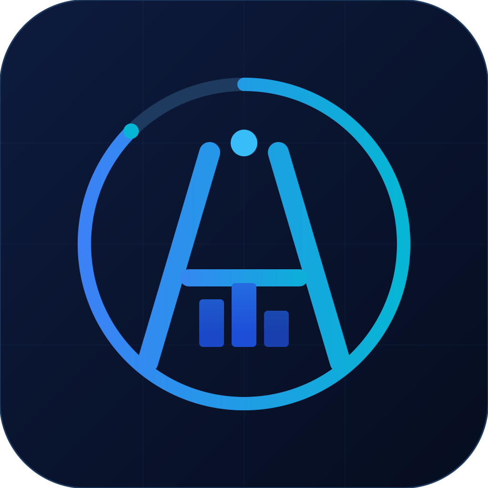

# Altron — Personal Budget Tracker

A minimal, opinionated budgeting app built as a native macOS desktop application. Designed around how I personally think about money — not how generic finance apps think you should.



---

## Why I built this

Every budgeting app I tried was either too bloated or too generic. I wanted something that reflected my actual spending categories, my income pattern as a student with an internship stipend, and my savings targets — nothing more, nothing less. So I built it.

---

## What it does

- Tracks income and expenses across custom personal categories
- Gives a clear picture of spending vs. savings at a glance
- Designed for a mobile-like focused experience on desktop — no dashboard clutter
- Data stays local — no cloud, no accounts, no subscriptions

---

## Tech stack

| Layer | Technology |
|---|---|
| UI | React 18 |
| Build | Vite 5 |
| Desktop wrapper | Electron 30 |
| Packaging | electron-builder |
| Styling | CSS / inline styles |

---

## Run locally

```bash
# Install dependencies
npm install

# Run in development (browser)
npm run dev

# Run as desktop app
npm run electron

# Build distributable .app
npm run dist
```

---

## Project structure

```
altron/
  electron.cjs     # Electron main process — native window config
  src/
    main.jsx       # React entry point
    App.jsx        # Main application component
  index.html       # HTML shell
  vite.config.js   # Vite build config
  package.json     # Dependencies and build config
```

---

## Background

Built by **Avik Mandhyan** — Economics Honours student at Christ University, Bengaluru. Developed with AI assistance (Claude by Anthropic) as part of a personal project to apply finance knowledge through software.

Part of a broader set of finance and productivity tools built to bridge economics understanding with practical software development.

→ Also see: [AvikQuest](../avikquest) — a gamified life and career goal tracker
